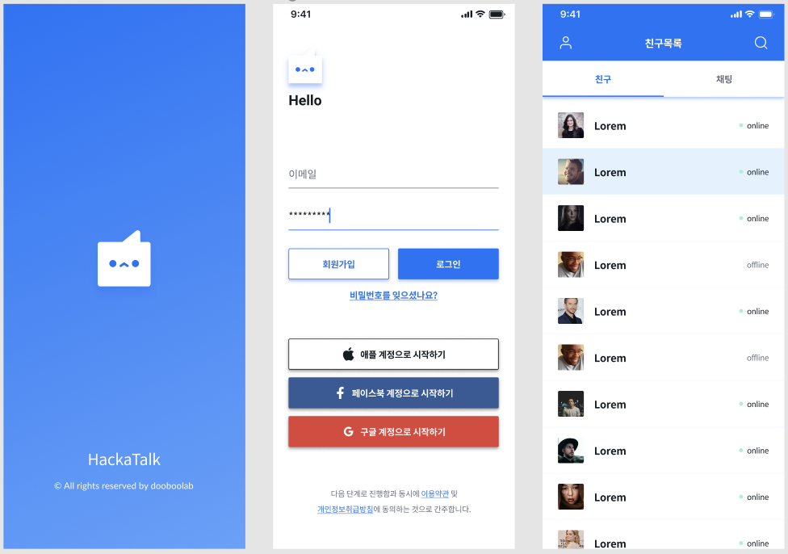
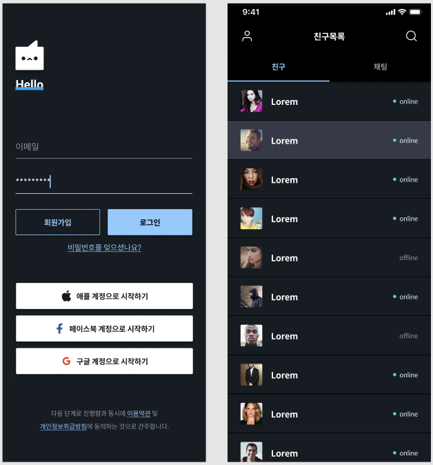

Our design is opened for all developers around the work. This work is done in [Figma](https://www.figma.com) by the wonderful designer Megun Kim :tada:.

## Dark mode

We also support the dark mode.

Our theme is managed by [@dooboo-ui/theme](https://www.npmjs.com/package/@dooboo-ui/theme) which is one of the packages nested in [dooboo-ui](http://github.com/dooboolab/dooboo-ui).
